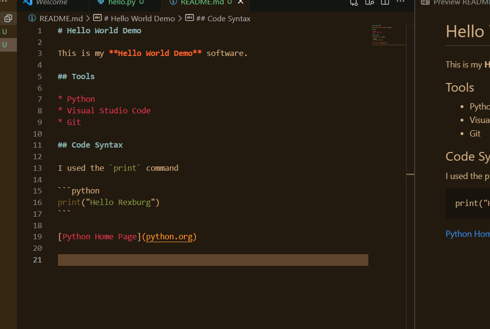

# Overview

This is my simple **Hello World** program that highlights how to print Hello World.

[Software Demo Video](https://youtu.be/ws963xakyXY)

# Hello World Demo

This is my **Hello World Demo** software.

# Tools

* Python Language
* Visual Studio Code
* Git

## Code Syntax

I used the `print` command

```python
print("Hello World")
```

[Python Home Page](python.org)

